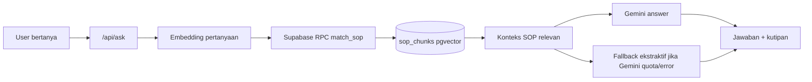
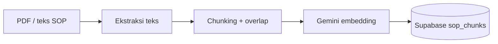

# NEXAID

NEXAID adalah chatbot RAG untuk membantu relawan, koordinator posko, dan petugas lapangan menjawab pertanyaan operasional bencana hanya berdasarkan dokumen SOP resmi yang sudah di-ingest. Jawaban selalu dikaitkan dengan kutipan sumber agar keputusan di lapangan bisa diverifikasi dan dipertanggungjawabkan.

Proyek ini mengikuti spesifikasi di [PRD.md](base-knowledge/PRD.md) dan ringkasan teknis di [discovery.md](base-knowledge/discovery.md).

## Ringkasan Produk

Saat tanggap darurat, SOP bencana sering berbentuk PDF panjang dan sulit dicari cepat. NEXAID memecah dokumen SOP menjadi chunk, membuat embedding, menyimpannya ke Supabase pgvector, lalu mengambil potongan paling relevan ketika pengguna bertanya.

Target MVP:

- Satu halaman tanya-jawab yang nyaman dipakai dari browser HP.
- Jawaban operasional dari SOP, bukan pengetahuan bebas.
- Kutipan sumber tampil bersama jawaban.
- Jika jawaban tidak ditemukan dalam SOP, sistem menjawab `Tidak ditemukan di SOP.`
- Tetap punya fallback ekstraktif saat quota Gemini generation habis.

## Cara Kerja



Alur ingest:



## Fitur

- UI tanya SOP dengan contoh pertanyaan, area jawaban, dan kartu kutipan.
- Endpoint `/api/ask` untuk retrieval, grounded generation, dan fallback ekstraktif.
- Endpoint `/api/ingest` untuk ingest teks SOP manual dari UI/API.
- Skrip `scripts/ingest-base-knowledge.mjs` untuk ingest PDF di `base-knowledge`.
- Schema Supabase pgvector di `supabase/schema.sql`.
- Validasi agar `SUPABASE_SERVICE_ROLE_KEY` tidak keliru diisi `sb_publishable...`.

## Stack

- Next.js App Router + TypeScript
- Supabase Postgres + pgvector
- Vercel AI SDK
- Google Gemini untuk embedding dan generation
- Vercel untuk deployment

## Struktur Penting

```text
app/
  api/
    ask/route.ts          # RAG ask endpoint
    ingest/route.ts       # ingest teks SOP
  lib/
    rag.ts                # chunking, model config, fallback jawaban
    supabase.ts           # Supabase admin client
  page.tsx                # UI utama NEXAID
  globals.css             # styling UI
base-knowledge/
  PRD.md
  discovery.md
  SOP-1.pdf
  SOP-2.pdf
  SOP-3.pdf
  extracted/              # hasil ekstraksi teks lokal
scripts/
  ingest-base-knowledge.mjs
supabase/
  schema.sql
```

## Environment

Isi `.env.local` untuk local development dan set nilai yang sama di Vercel:

```env
SUPABASE_URL=
SUPABASE_SERVICE_ROLE_KEY=
GOOGLE_GENERATIVE_AI_API_KEY=
```

Opsional:

```env
GEMINI_MODEL=gemini-2.0-flash
GEMINI_EMBEDDING_MODEL=gemini-embedding-001
GEMINI_EMBEDDING_DIMENSIONS=768
SOP_MATCH_COUNT=5
```

Catatan penting:

- `SUPABASE_SERVICE_ROLE_KEY` harus memakai service role/server secret key.
- Jangan memakai key yang diawali `sb_publishable...` untuk server ingest, karena akan ditolak RLS.
- `GOOGLE_GENERATIVE_AI_API_KEY` dipakai untuk embedding dan generation. Jika quota generation habis, `/api/ask` tetap mengembalikan fallback ekstraktif dari kutipan SOP.

## Setup Supabase

Jalankan SQL di [supabase/schema.sql](supabase/schema.sql) melalui Supabase SQL Editor.

Schema tersebut membuat:

- extension `vector`
- tabel `sop_chunks`
- index vector HNSW
- fungsi RPC `match_sop`
- kolom `source` dan `chunk_index` agar UI bisa menampilkan asal kutipan

## Jalankan Lokal

```bash
npm.cmd install
npm.cmd run dev
```

Buka:

```text
http://127.0.0.1:3000
```

Build production:

```bash
npm.cmd run lint
npm.cmd run build
```

## Ingest Knowledge Base

Untuk ingest semua PDF di `base-knowledge`:

```bash
node scripts\ingest-base-knowledge.mjs
```

Status terakhir knowledge base:

| Dokumen | Status | Catatan |
| --- | --- | --- |
| `SOP-1.pdf` | Ingest berhasil | 5 chunk |
| `SOP-2.pdf` | Ingest berhasil | 3 chunk |
| `SOP-3.pdf` | Belum masuk | PDF tidak punya text layer; OCR Gemini kena quota 429 |

Total data yang sudah masuk Supabase: `8` chunk dari `SOP-1` dan `SOP-2`.

Untuk ingest manual lewat UI, buka panel `Ingest teks SOP` di halaman utama. Untuk API langsung:

```bash
curl -X POST http://127.0.0.1:3000/api/ingest \
  -H "Content-Type: application/json" \
  -d "{\"source\":\"SOP Pendistribusian Logpal\",\"teks\":\"...teks SOP resmi...\"}"
```

## API

### POST `/api/ask`

Request:

```json
{
  "question": "Siapa yang menetapkan status darurat bencana?"
}
```

Response:

```json
{
  "answer": "Jawaban dari SOP atau fallback ekstraktif",
  "sources": [
    {
      "source": "SOP-1",
      "chunkIndex": 0,
      "similarity": 0.74,
      "excerpt": "Kutipan SOP..."
    }
  ]
}
```

### POST `/api/ingest`

Request:

```json
{
  "source": "Nama SOP",
  "teks": "Isi SOP panjang..."
}
```

Response:

```json
{
  "inserted": 3,
  "chunks": 3,
  "schema": "enhanced"
}
```

## Deploy Vercel

Checklist deploy:

- Push kode terbaru ke repository yang terhubung ke Vercel.
- Set environment variables di Vercel:
  - `SUPABASE_URL`
  - `SUPABASE_SERVICE_ROLE_KEY`
  - `GOOGLE_GENERATIVE_AI_API_KEY`
  - opsional `GEMINI_MODEL`, `GEMINI_EMBEDDING_MODEL`, `SOP_MATCH_COUNT`
- Redeploy production.
- Tes URL production dengan pertanyaan dari SOP.

## Batasan MVP

- Belum ada login/admin role.
- Belum ada upload PDF otomatis dari UI.
- `SOP-3.pdf` perlu OCR ketika quota Gemini tersedia atau ketika teks OCR sudah disediakan.
- Kualitas jawaban generation bergantung pada quota dan ketersediaan model Gemini. Saat quota habis, sistem tetap menampilkan kutipan SOP relevan sebagai fallback.

## Verifikasi Terakhir

Perubahan terakhir sudah divalidasi dengan:

```bash
npm.cmd run lint
npm.cmd run build
```

Endpoint `/api/ask` juga sudah diuji lokal dan mengembalikan HTTP `200` dengan sumber dari `SOP-1`/`SOP-2`.
