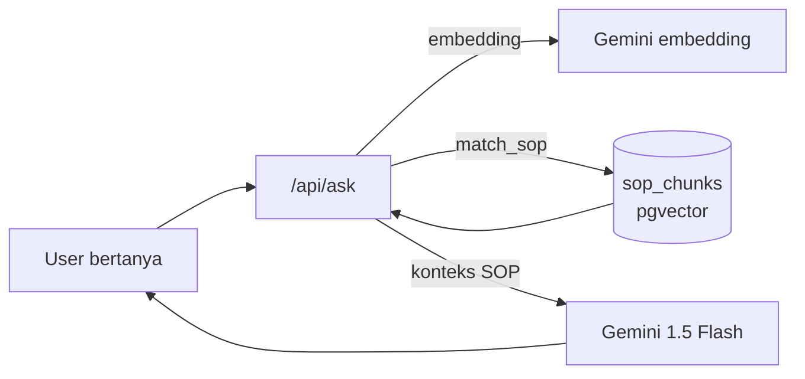

# discovery

<aside>
📘

**Mini-project simpel:** chatbot yang menjawab **hanya berdasarkan dokumen SOP bencana** (BNPB/BPBD) memakai RAG, lengkap dengan kutipan sumber (anti-halusinasi). Stack: **Next.js + Supabase (pgvector) + Vercel**. Bisa dikerjakan dari nol sampai live ~1 jam, biaya Rp 0.

</aside>

| Info | Detail |
| --- | --- |
| **Fitur** | 1 halaman: tanya → jawaban dari SOP + kutipan |
| **Stack** | Next.js 15 • Supabase (pgvector) • Vercel • Gemini (gratis) |
| **Estimasi** | ~1 jam |
| **Biaya** | Rp 0 (free-tier) |

---

## 1. Cara Kerja (RAG)



1. **Sekali di awal (ingest):** teks SOP dipecah jadi potongan → dibuat embedding → disimpan di Supabase.
2. **Saat tanya:** pertanyaan → embedding → cari 4 potongan paling mirip → LLM menjawab hanya dari potongan itu + kutipan.

---

## 2. Setup Supabase

```sql
create extension if not exists vector;

create table sop_chunks (
  id uuid primary key default gen_random_uuid(),
  konten text not null,
  embedding vector(768)          -- 768 = Gemini text-embedding-004
);

-- Pencarian kemiripan
create or replace function match_sop (
  query_embedding vector(768),
  match_count int default 4
) returns table (konten text, similarity float)
language sql stable as $$
  select konten, 1 - (embedding <=> query_embedding) as similarity
  from sop_chunks
  order by embedding <=> query_embedding
  limit match_count;
$$;
```

---

## 3. Struktur File

```
app/
├─ page.tsx            # UI: input pertanyaan + tampil jawaban & kutipan
└─ api/
   ├─ ingest/route.ts  # sekali pakai: masukkan SOP ke DB
   └─ ask/route.ts     # cari + jawab
lib/
└─ supabase.ts        # client
```

---

## 4. Kode Inti

### `/api/ingest` — masukkan SOP (jalankan sekali)

```tsx
// app/api/ingest/route.ts
import { google } from "@ai-sdk/google"
import { embedMany } from "ai"
import { createClient } from "@supabase/supabase-js"

export async function POST(req: Request) {
  const { teks } = await req.json()          // teks SOP panjang
  const sb = createClient(process.env.SUPABASE_URL!, process.env.SUPABASE_SERVICE_ROLE_KEY!)

  // pecah sederhana per ~500 kata
  const kata = teks.split(/\s+/)
  const chunks: string[] = []
  for (let i = 0; i < kata.length; i += 500) chunks.push(kata.slice(i, i + 500).join(" "))

  const { embeddings } = await embedMany({
    model: google.textEmbeddingModel("text-embedding-004"),
    values: chunks,
  })
  await sb.from("sop_chunks").insert(
    chunks.map((konten, i) => ({ konten, embedding: embeddings[i] }))
  )
  return Response.json({ inserted: chunks.length })
}
```

### `/api/ask` — tanya

```tsx
// app/api/ask/route.ts
import { google } from "@ai-sdk/google"
import { embed, generateText } from "ai"
import { createClient } from "@supabase/supabase-js"

export async function POST(req: Request) {
  const { question } = await req.json()
  const sb = createClient(process.env.SUPABASE_URL!, process.env.SUPABASE_SERVICE_ROLE_KEY!)

  const { embedding } = await embed({
    model: google.textEmbeddingModel("text-embedding-004"),
    value: question,
  })
  const { data: chunks } = await sb.rpc("match_sop", { query_embedding: embedding, match_count: 4 })
  const context = (chunks ?? []).map((c: any) => c.konten).join("\n---\n")

  const { text } = await generateText({
    model: google("gemini-1.5-flash"),
    system: "Jawab HANYA dari konteks SOP di bawah. Jika tidak ada, jawab 'Tidak ditemukan di SOP'. Sertakan kutipan singkat pendukung.",
    prompt: `KONTEKS:\n${context}\n\nPERTANYAAN: ${question}`,
  })
  return Response.json({ answer: text, sources: chunks })
}
```

### `app/page.tsx` — UI minimal

```tsx
"use client"
import { useState } from "react"

export default function Home() {
  const [q, setQ] = useState("")
  const [ans, setAns] = useState("")
  const [loading, setLoading] = useState(false)

  async function tanya() {
    setLoading(true)
    const r = await fetch("/api/ask", {
      method: "POST", body: JSON.stringify({ question: q }),
    })
    const d = await r.json()
    setAns(d.answer)
    setLoading(false)
  }

  return (
    <main style={{ maxWidth: 640, margin: "40px auto", fontFamily: "sans-serif" }}>
      <h1>NEXAID</h1>
      <textarea value={q} onChange={e => setQ(e.target.value)}
        placeholder="Cth: Prosedur distribusi air bersih di pengungsian?"
        rows={3} style={{ width: "100%" }} />
      <button onClick={tanya} disabled={loading}>
        {loading ? "Mencari..." : "Tanya"}
      </button>
      {ans && <p style={{ whiteSpace: "pre-wrap", marginTop: 16 }}>{ans}</p>}
    </main>
  )
}
```

---

## 5. Environment (.env)

```jsx
SUPABASE_URL=
SUPABASE_SERVICE_ROLE_KEY=        # server-only
GOOGLE_GENERATIVE_AI_API_KEY=     # Gemini gratis (embedding + generate)
```

Paket: `npm i ai @ai-sdk/google @supabase/supabase-js`

---

## 6. Checklist 1 Jam

- [ ]  `npx create-next-app` → push ke GitHub → connect Vercel (deploy kosong dulu)
- [ ]  Buat project Supabase → jalankan SQL (extension + tabel + fungsi `match_sop`)
- [ ]  Ambil API key Gemini (Google AI Studio, gratis) → isi `.env`
- [ ]  Tempel kode `ingest`, `ask`, `page.tsx`
- [ ]  Jalankan ingest sekali (POST `/api/ingest` dengan teks SOP) untuk mengisi DB
- [ ]  Set env di Vercel → **deploy final** → tes tanya

<aside>
💡

**Tips:** untuk demo, cukup tempel 2–3 halaman SOP (mis. bab distribusi logistik & manajemen pengungsi). Kalau mau tampilkan kutipan sumber di UI, render `sources` dari respons `/api/ask` di bawah jawaban.

</aside>